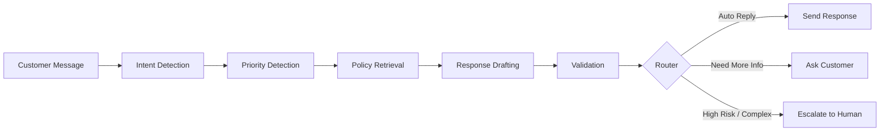

# Banking AI-Agent — Yêu cầu dự án

> **Môn học:** Applications of Natural Language Processing in Industry (CSC15012)
> **Giảng viên:** Dr. Nguyễn Hồng Bửu Long
> **Trường:** Đại học Khoa học Tự nhiên — ĐHQG TP.HCM
> **Thời gian:** 04/2026

---

## 1. Tổng quan dự án

Thiết kế và triển khai một **AI Agentic Workflow** đơn giản cho hệ thống hỗ trợ khách hàng trong lĩnh vực ngân hàng. Hệ thống cần có khả năng:

1. Nhận tin nhắn từ khách hàng.
2. Nhận diện **intent** (ý định) tương ứng.
3. Truy xuất thông tin **chính sách** liên quan.
4. Sinh **bản nháp phản hồi** cho khách hàng.
5. Quyết định xem yêu cầu có thể xử lý tự động hay cần **chuyển tiếp** (escalate) đến nhân viên.

---

## 2. Yêu cầu chức năng

### 2.1 Thiết kế hệ thống (System Design)

- Workflow dạng **multi-node**; không yêu cầu agent tự chủ hoàn toàn — một thiết kế **structured workflow** hoặc **state-machine** đơn giản là đủ.
- Workflow **bắt buộc** gồm **6 node** sau:

| # | Node | Mô tả |
|---|------|-------|
| 1 | **Intent Detection Node** | Nhận diện intent của khách hàng từ tin nhắn đầu vào. **Phải sử dụng mô hình fine-tuned từ Lab 2** (core node). |
| 2 | **Priority / Risk Detection Node** | Phân loại mức độ ưu tiên: `low`, `medium`, `high`. Có thể dùng rules / keywords / lightweight logic. Ví dụ: giao dịch đáng ngờ, tài khoản bị khóa, mất tiền → `high`. |
| 3 | **Policy Retrieval Node** | Truy xuất FAQ / policy / support guideline liên quan dựa trên intent đã phát hiện. Dữ liệu từ `policies.py` (dummy data). |
| 4 | **Response Drafting Node** | Sinh bản nháp phản hồi cho khách hàng. Gọi LLM (gpt-oss qua Ollama). Draft cần xét: tin nhắn gốc, intent, priority, policy. Output gồm: draft reply, missing info, next suggested action. |
| 5 | **Validation Node** | Kiểm tra draft: quá ngắn? thiếu thông tin quan trọng? độ tin cậy intent quá thấp? Giúp tăng reliability & transparency. |
| 6 | **Escalation / Router Node** | Quyết định cuối cùng: ① Gửi phản hồi trực tiếp, ② Yêu cầu khách cung cấp thêm thông tin, hoặc ③ Chuyển tiếp sang nhân viên hỗ trợ. |

### 2.2 Pipeline thực thi (Orchestrator)

Orchestrator gọi các node **theo đúng thứ tự**:

```
Intent Detection → Priority Detection → Policy Retrieval → Response Drafting → Validation → Routing
```

- Thu thập **intermediate outputs** để quan sát workflow trace khi test.
- File `orchestrator.py` đại diện cho toàn bộ AI agentic pipeline.

### 2.3 Chạy mô hình LLM

- Sử dụng **gpt-oss-20b** chạy qua **Ollama** trên Google Colab (GPU miễn phí).
- Dùng **Pinggy** để forward port local của Ollama (`localhost:11434`) ra public URL (`http://*.a.free.pinggy.link`), từ đó gọi API từ bên ngoài.
- Tham khảo notebook: `Ollama-Pinggy.ipynb`.
- Khuyến khích đọc tài liệu Ollama để hiểu rõ hơn.

---

## 3. Yêu cầu về deliverables

### 3.1 Source code trên GitHub

Toàn bộ source code phải được **commit lên GitHub** để thuận tiện cho việc đánh giá.

### 3.2 Video demo

- Submit **1 video ngắn** demo workflow.
- Video cần thể hiện:
  - Một hoặc nhiều **tin nhắn mẫu** từ khách hàng.
  - **Output của từng node** chính trong workflow.
  - **Kết quả cuối cùng**: phản hồi hoặc quyết định escalation.
- Thời lượng khuyến nghị: **2–5 phút**.

### 3.3 README.md

- Mô tả mục tiêu tổng thể của dự án.
- Giải thích workflow của hệ thống banking agentic.
- Hướng dẫn cài đặt dependencies và chạy project.
- Cung cấp URL video demo.

---

## 4. Cấu trúc source code (khuyến nghị)

```
banking-agentic/
├── README.md
├── requirements.txt             # Danh sách Python packages
├── run.py                       # Entry point — khởi chạy FastAPI server
├── app/
│   ├── main.py                  # Tạo & cấu hình FastAPI app, đăng ký routes
│   ├── core/
│   │   ├── settings.py          # Cấu hình: Ollama URL, model name, fine-tuned model path
│   │   └── schemas.py           # Input/output schemas (request, response, node outputs, trace)
│   ├── data/
│   │   └── policies.py          # Dummy policy data / FAQ snippets
│   ├── clients/
│   │   ├── base.py              # Base client interface (abstraction layer)
│   │   └── ollama_client.py     # Ollama client: gửi prompt, nhận output
│   ├── nodes/
│   │   ├── intent_node.py       # Intent detection (fine-tuned model từ Lab 2)
│   │   ├── priority_node.py     # Priority/risk classification (rules/keywords)
│   │   ├── policy_node.py       # Policy retrieval từ policies.py
│   │   ├── draft_node.py        # Response drafting (gọi Ollama/gpt-oss)
│   │   ├── validation_node.py   # Validation: kiểm tra chất lượng draft
│   │   └── router_node.py       # Routing: reply / ask more info / escalate
│   └── agent/
│       └── orchestrator.py      # Main workflow controller
└── examples/
    └── sample_requests.json     # Tin nhắn mẫu để test (nhiều intents khác nhau)
```

---

## 5. Chi tiết từng file

### 5.1 `run.py`
- Entry point duy nhất để chạy ứng dụng.
- Khởi chạy FastAPI server.
- **Giữ đơn giản**, không chứa business logic.

### 5.2 `app/main.py`
- Tạo và cấu hình FastAPI application.
- Đăng ký API routes và khởi tạo server object.

### 5.3 `app/core/settings.py`
- Lưu trữ cấu hình ứng dụng dựa trên environment.
- Định nghĩa: **Ollama server URL**, **tên model response generation**, **path/identifier của fine-tuned intent model** (Lab 2).

### 5.4 `app/core/schemas.py`
- Định nghĩa input/output schemas cho toàn hệ thống.
- Bao gồm: request schema, response schema, node outputs, trace format.
- Chứa structured result objects cho: intent detection, priority classification, policy retrieval, response drafting, validation, routing.

### 5.5 `app/data/policies.py`
- Lưu trữ dữ liệu policy / FAQ snippets.
- Chỉ cần **dummy data** mô phỏng dữ liệu thực (không cần xây database).

### 5.6 `app/clients/base.py`
- Định nghĩa base client interface cho việc gọi model.
- Dùng làm abstraction layer để tất cả model-calling components tuân theo interface thống nhất.

### 5.7 `app/clients/ollama_client.py`
- Implement Ollama client: gửi prompt đến Ollama và nhận output từ model.

### 5.8 `app/nodes/intent_node.py`
- **Core node** — Node quan trọng nhất.
- **Bắt buộc** sử dụng fine-tuned model từ Lab 2.
- Nhận tin nhắn khách hàng → trả về predicted banking intent.
- Có thể thiết kế như wrapper quanh inference class / checkpoint loader của Lab 2.

### 5.9 `app/nodes/priority_node.py`
- Phân loại priority: `low` / `medium` / `high`.
- Có thể dùng rules, keywords, hoặc lightweight logic.
- Ví dụ high priority: giao dịch đáng ngờ, tài khoản bị khóa, mất tiền.

### 5.10 `app/nodes/policy_node.py`
- Nhận intent đã dự đoán → trả về policy/guideline liên quan từ `policies.py`.
- Mục đích: ground response trong predefined support knowledge.

### 5.11 `app/nodes/draft_node.py`
- Gọi Ollama (gpt-oss) để sinh draft reply.
- Draft phải xét đến: **customer message**, **detected intent**, **priority level**, **retrieved policy**.
- Output: draft reply, missing information, next suggested action.

### 5.12 `app/nodes/validation_node.py`
- Kiểm tra draft có chấp nhận được không.
- Kiểm tra: response quá ngắn? thiếu thông tin quan trọng? intent confidence quá thấp?
- Có thể giữ đơn giản nhưng phải giúp tăng reliability & transparency.

### 5.13 `app/nodes/router_node.py`
- Quyết định cuối cùng dựa trên output của các node trước:
  1. **Gửi reply trực tiếp** cho khách hàng.
  2. **Hỏi thêm thông tin** từ khách hàng.
  3. **Escalate** sang nhân viên hỗ trợ.

### 5.14 `app/agent/orchestrator.py`
- Workflow controller chính.
- Gọi tất cả node theo đúng thứ tự.
- Thu thập intermediate outputs → phục vụ workflow trace.

### 5.15 `examples/sample_requests.json`
- Chứa nhiều tin nhắn mẫu từ khách hàng cho test.
- Phải cover **nhiều intents** khác nhau: transfer failure, card not received, blocked account, refund request, v.v.
- Dùng để demo workflow và verify output.

---

## 6. Tech Stack

| Thành phần | Công nghệ |
|---|---|
| Backend Framework | **FastAPI** |
| LLM | **gpt-oss-20b** (qua Ollama) |
| Intent Detection | **Fine-tuned model từ Lab 2** (BANKING77 dataset) |
| LLM Hosting | **Google Colab** (GPU miễn phí) + **Ollama** |
| Port Forwarding | **Pinggy** (`localhost:11434` → public URL) |
| Language | **Python** |
| Version Control | **GitHub** |

---

## 7. Lưu ý quan trọng

> [!IMPORTANT]
> ### Intent Detection Node là core component
> - Đây là node **bắt buộc** và **quan trọng nhất** trong workflow.
> - **Phải** sử dụng fine-tuned model từ Lab 2 (trained trên BANKING77 dataset).
> - Được xem là **main specialized classifier** của hệ thống.

> [!IMPORTANT]
> ### Không cần xây database thực
> - Policy data chỉ cần **dummy data** trong `policies.py`.
> - Mô phỏng dữ liệu thực là đủ, không cần kết nối database.

> [!WARNING]
> ### Tách biệt business logic khỏi entry point
> - `run.py` chỉ dùng để **launch project**, không chứa business logic.
> - Business logic nằm trong các node và orchestrator.

> [!NOTE]
> ### Thiết kế hệ thống linh hoạt
> - Không yêu cầu fully autonomous agent.
> - **Structured workflow** hoặc **simple state-machine** là đủ.
> - Priority node có thể dùng rules/keywords đơn giản, không bắt buộc dùng ML model.
> - Validation node có thể giữ đơn giản nhưng phải có mặt.

> [!NOTE]
> ### Abstraction layer cho model calling
> - Dù chỉ dùng Ollama, vẫn nên có `base.py` làm abstraction layer.
> - Đảm bảo tất cả model-calling components tuân theo **consistent interface**.

> [!TIP]
> ### Chạy LLM trên Colab
> - Dùng GPU miễn phí trên Google Colab để chạy Ollama + gpt-oss-20b.
> - Sử dụng Pinggy để expose port ra public.
> - Tham khảo notebook `Ollama-Pinggy.ipynb` được cung cấp sẵn.

> [!TIP]
> ### Video demo
> - Thời lượng **2–5 phút**.
> - Phải cho thấy: input messages → output của từng node → kết quả cuối cùng.

---

## 8. Workflow tổng quan (High-level)



---

## 9. Checklist tổng hợp

- [ ] Thiết kế workflow multi-node (6 nodes bắt buộc)
- [ ] Implement Intent Detection Node (fine-tuned model Lab 2)
- [ ] Implement Priority Detection Node
- [ ] Implement Policy Retrieval Node + dummy policy data
- [ ] Implement Response Drafting Node (gọi Ollama/gpt-oss)
- [ ] Implement Validation Node
- [ ] Implement Router/Escalation Node
- [ ] Implement Orchestrator (gọi các node theo thứ tự, thu thập trace)
- [ ] Implement Ollama client + base client interface
- [ ] Định nghĩa schemas (request, response, node outputs, trace)
- [ ] Cấu hình settings (Ollama URL, model name, fine-tuned model path)
- [ ] Tạo FastAPI app + API routes
- [ ] Tạo sample requests cho testing
- [ ] Viết README.md đầy đủ
- [ ] Quay video demo (2–5 phút)
- [ ] Push toàn bộ source code lên GitHub
